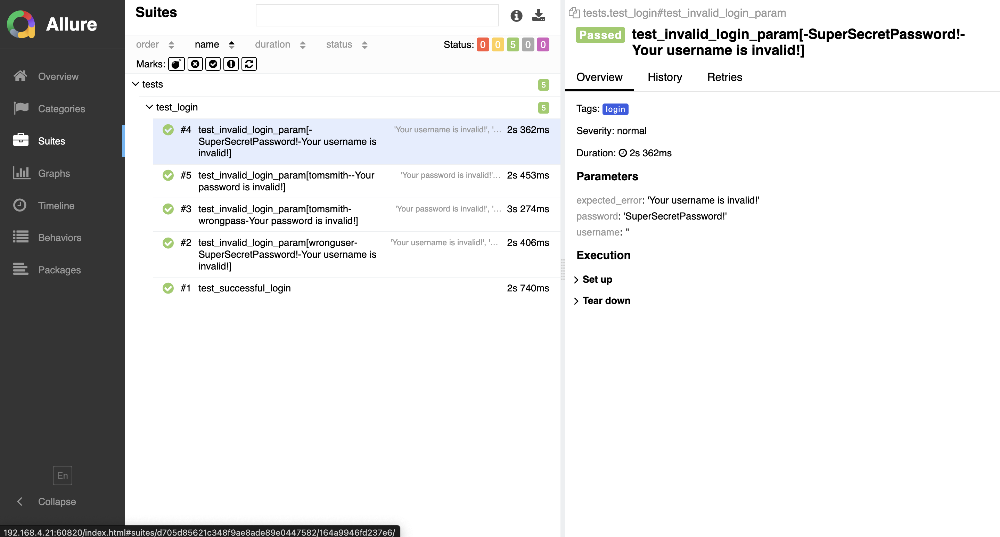

# 🤖 Selenium Automation Framework (Python)

End-to-end test automation framework using **Selenium**, built to demonstrate QA skills across key areas including:

- Pytest for test orchestration
- Page Object Model for maintainability
- YAML config for environment setup
- Allure reports for rich test insights
- Cross-browser and headless execution

---

## 🛠️ Tech Stack

- Python 3.13.0
- Selenium WebDriver
- Pytest
- Allure Reporting
- YAML for Config Management
- GitHub Actions (CI)
- Requests (for API testing)

---

## ▶️ How to Run Tests

- Create a python virtual environment
- Install dependencies:

```bash
pip install -r requirements.txt
```

- Run tests:

```bash
pytest [--browser <chrome or firefox>] [--alluredir=allure-results]
```

- View Allure Report:

```bash
allure serve allure-results
```

---

## 🏷️ Test Labels

Tests are marked using `pytest.mark`:

- `@login`: Login functionality tests
- `@api`: API tests, might be combined with UI tests as well

Run specific types:

```bash
pytest -m "login"
```

---

## 📂 Branching Strategy

- `main` – Clean final project
- `phase-X/...` – Learning/building phases

---

## 📸 Sample Screenshots



---

## 📄 Future Enhancements

- Dockerized test environment
- Test Strategy doc
- Coverage reporting

---

## 👤 Author

Built by Dharak Koradia — QA Engineer.
